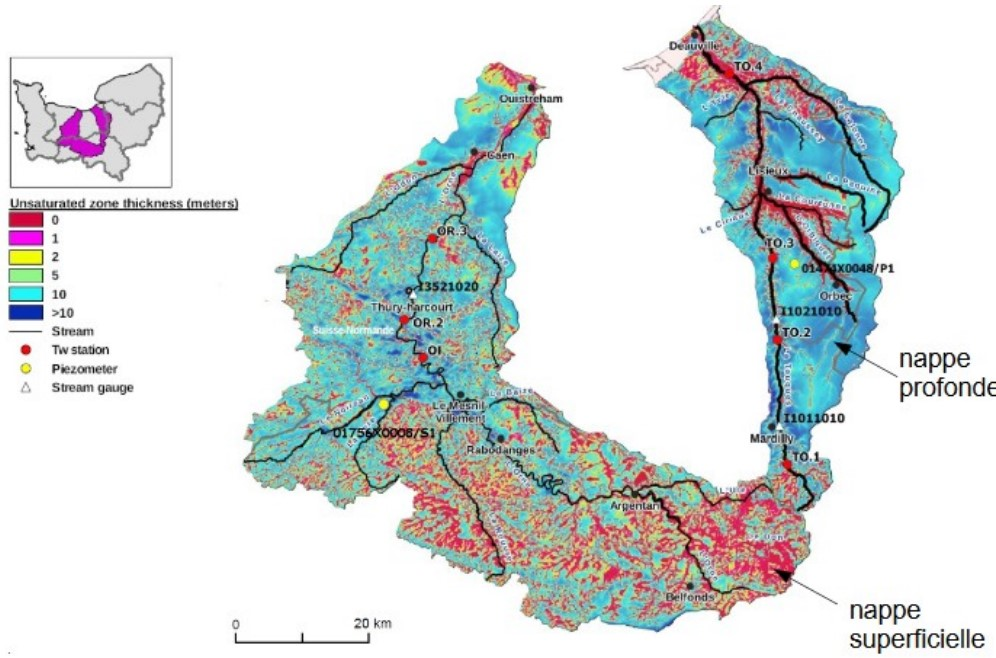

```{r, include = F}
defOut <- knitr::knit_hooks$get("plot")  # save the default plot hook 
knitr::knit_hooks$set(plot = function(x, options) {  # set new plot hook ...
  x <- defOut(x, options)  # first apply the default hook
  if(!is.null(options$wrapfigure)) {  # then, if option wrapfigure is given ...
    # create the new opening string for the wrapfigure environment ...
    wf <- sprintf("\\begin{wrapfigure}{%s}{%g\\textwidth}", options$wrapfigure[[1]], options$wrapfigure[[2]])
    x  <- gsub("\\begin{figure}", wf, x, fixed = T)  # and replace the default one with it.
    x  <- gsub("{figure}", "{wrapfigure}", x, fixed = T)  # also replace the environment ending
    if (!is.null(options$vspace))
    x  <- gsub("\\end{wrapfigure}", paste("\\vspace{", options$vspace, "}\\end{wrapfigure}", sep = ""), x, fixed = T)  # adding/removing vspace
  }
  return(x)
})
```

# Introduction
```{r map, echo = FALSE, warning = FALSE, message = FALSE, fig.asp = 0.8, fig.width = 4, fig.align = "right", fig.cap = "Placement des sondes de la Touques", out.width = "100%", wrapfigure = list("R", .3), vspace = "-20pt"}
# load map and center of the zoomed map
worldmap <- ne_countries(scale = 'medium', type = 'map_units',
                         returnclass = 'sf')
france = worldmap[worldmap$name == 'France',]
df_caen_coord = data.frame(lon = -0.370679, lat = 49.182863)

zoom_level = 7
lon_span = 360 / 2^zoom_level
lat_span = 180 / 2^zoom_level
lon_bounds <- c(df_caen_coord$lon - lon_span / 2, df_caen_coord$lon + lon_span / 2)
lat_bounds <- c(df_caen_coord$lat - lat_span / 2, df_caen_coord$lat + lat_span / 2)

attach(coordinates_df)
p = ggplot() + 
    geom_sf(data = france) + 
    geom_point(aes(data = df_caen_coord, x = df_caen_coord$lon, y = df_caen_coord$lat, label = "Caen"), color = "blue", size = 5) + 
    geom_text(aes(data = df_caen_coord, x = df_caen_coord$lon, y = df_caen_coord$lat, label = "Caen"), hjust = 1.5, vjust = 0.5) +
    geom_point(data = coordinates_df, aes(x = lon_wgs84, y = lat_wgs84, label = id_sonde), color = color) + 
    geom_text(aes(x = lon_wgs84, y = lat_wgs84, label = id_sonde), hjust = -0.5, vjust = 0.25) +
    coord_sf(xlim = lon_bounds, ylim = lat_bounds) + 
    theme_bw() +
    labs(x = "Longitude", y = "Latitude")
plot(p)
detach(coordinates_df)
```

Ce travail porte sur une base de données comportant 93 832 observations sur la Touque, un fleuve normand prenant sa source dans le département de l'Orne et se jettant dans la Manche au niveau de Deauville.
Il s'agit de températures relevées du 29 mai 2013 au 5 octobre 2018 sur quatre stations classées d'amont en aval, la dernière étant la plus proche de la mer comme on peut le voir sur la figure 1. 
Les variables que nous utiliserons sont entre autres l'heure et date de l'observation, la température de l'eau, de l'air et la pluviométrie le tout en fonction des sondes qui auront relevées ces données.

De part cette base, une problématique peut d'ores et déjà se former, problématique qui orientera donc nos analyses et interprétations : 
**Quels sont les facteurs qui pourraient influencer la température de la Touque en fonction de la géologie et du climat près des sondes ?**


# Analyse
Afin de répondre aux questions que cette problématique soulève, nous allons avoir recours à différentes méthodes d'analyse de données comme 
l'utilisation de statistiques descriptives, l'analyse en composantes indépendantes et l'analyse en composantes principales. En ajoutant
des recherches sur internet, nous pourrons efficacement analyser et interpréter les résultats retournées par ces méthodes.


## Statistiques descriptives
### Premières observations sur les données
Nous avons tout d'abord décidé de réaliser un bref résumé des données à notre disposition (table 1). 

```{r summary, echo = FALSE, warning = FALSE, message = FALSE, fig.pos = "!H"}
concatenated_summary = custom_summary(df)
recap = as.data.frame(concatenated_summary$Teau)
recap = rbind(recap, as.data.frame(concatenated_summary$Tair.EOBS))
recap = rbind(recap, as.data.frame(concatenated_summary$Rainf.EOBS))
row.names(recap) = c("Teau", "Tair.EOBS", "Rainf.EOBS")

recap = recap[, c("Min", "Max", "1st quantile", "Median", "3rd quantile", "Mean", "Geometric mean", "Variation coefficient")]
colnames(recap) = c("Min", "Max", "Q1", "50%", "Q3", "Mean", "Geometric mean", "Variation coeff")
knitr::kable(recap, caption = "Résumé des variables", format = "latex")

df$year = year(df$date)
df$month = month(df$date)
df$day = day(df$date)
df$hour = hour(df$t)

sub_df = df[df$id_sonde %in% id_sondes_list,][,c("Teau", "Tair.EOBS", "Rainf.EOBS", "year", "month", "day", "hour", "id_sonde")]
```

On remarque déjà que les moyennes et médianes des températures de l’eau et de l’air sont très proches 
et l’on peut d’ores et déjà supposer que ces variables sont peut être corrélées.
Pour ce qui est de la volumétrie on ne peut pour l’instant rien supposer compte tenu des valeurs que l’on dispose.
On peut noter aussi que la pluviométrie a un coefficient de variation élevé (180 %) mais que celui des températures 
sont assez basses (30% pour l'eau et 47% pour l'air), impliquant qu'il y a peut être des phénomènes
distincts à prendre en compte, notamment entre les températures de l'air/eau et la pluviométrie.

```{r fixed_cor_matrix, echo = FALSE, warning = FALSE, message = FALSE, fig.align = "right", fig.cap = "Matrice des corrélations corrigée", out.width = "100%", wrapfigure = list("R", .35), vspace = "-10pt"}
new_df = df[df$year %in% 2014:2017,]
cor_matrix = cor(new_df[,c("year", "month", "day", "hour", "Tair.EOBS", "Teau", "Rainf.EOBS")])
color = colorRampPalette(c("#BB4444", "#EE9988", "#FFFFFF", "#77AADD", "#4477AA"))
corrplot(cor_matrix, method = "color", diag = FALSE, type = "upper",
         col = color(200), order = "hclust",
         addCoef.col = "black", sig.level = 0.05, insig = "blank", mar = c(0,0,1,0)) 
```

Pour en apprendre plus, nous avons choisi de calculer une matrice des corrélations. En effet,
elle peut permettre d'affirmer ou d'infirmer s'il y a une corrélation entre deux variables.
Ici, nous avons décidé de corriger les données transmises pour les calculs de la matrice des corrélations
car, comme dit en introduction, les années 2013 et 2018 ne sont pas complètes, entraînant donc un biais
sur certaines valeurs. On peut remarquer qu'il n'y a pas de corrélation entre les températures de l'air/eau et la pluviométrie. 
Néanmoins, on peut souligner une très légère corrélation entre le mois de l'année et les températures de l'air 
et de l'eau. En effet, cela est due aux saisons que nous avons sur Terre (chaud en été, froid en hiver dans 
l'hémisphère Nord). Et enfin, une corrélation est avérée entre la température de l'eau et celle de l'air.

Cela est à néancer car ceux sont des données moyennées sur les quatres sondes. Qu'en est-il vraiment pour chaque sonde ?
Pour cela, nous avons effectué des régressions linéaires afin d'éclaircir un peu plus ce point.


### Régressions linéaires

```{r linreg, echo = FALSE, warning = FALSE, message = FALSE, out.width = "50%", fig.show = "hold"}
test_df = sub_df[,c("Rainf.EOBS", "Tair.EOBS", "id_sonde")]
attach(test_df)
y = Rainf.EOBS
x = Tair.EOBS
my.formula = y ~ x
ggplot(data = test_df, aes(x = Tair.EOBS, y = Rainf.EOBS, color = id_sonde)) +
  geom_point() + 
  geom_smooth(method = lm, formula = my.formula) +
  stat_poly_eq(formula = my.formula,
               eq.with.lhs = "italic(hat(y))~`=`~",
               aes(label = paste(..eq.label.., ..rr.label.., sep = "*plain(\",\")~")),
               parse = TRUE) +
  labs(x = "Température de l'air (en °C)", y = "Volumétrie de pluie (en mm)", colour = "Sonde ID", title = "Volumétrie de pluie en fonction de\nla température de l'air entre 2013-2018") +
  theme_plot
detach(test_df)

test_df = sub_df[,c("Teau", "Tair.EOBS", "id_sonde")]
attach(test_df)
y = Teau
x = Tair.EOBS
my.formula = y ~ x
ggplot(data = test_df, aes(x = x, y = y, colour = id_sonde)) +
  geom_point() + 
  geom_smooth(method = lm, se = FALSE, formula = my.formula) +
  stat_poly_eq(formula = my.formula,
               eq.with.lhs = "italic(hat(y))~`=`~",
               aes(label = paste(..eq.label.., ..rr.label.., sep = "*plain(\",\")~")),
               parse = TRUE) +
  labs(x = "Température de l'air (en °C)", y = "Température de l'eau (en °C)", colour = "Sonde ID", title = "Température de l'eau en fonction de\ncelle de l'air entre 2013-2018") +
  theme_plot
detach(test_df)
```
Pour commencer, voici un rappel : une régression linéaire est un modèle qui cherche à 
établire une relation linéaire entre une variable (dite expliquée) et une ou plusieurs 
autres variables (dites explicatives).

Le constat saute aux yeux et est sans équivoque pour la figure 3 : il n’y a aucune corrélation entre ces variables et comme $R^{2}$ est compris entre 0 et 0.01,
on peut en conclure que le volume de pluie tombé et la température de l'air sont deux phénomènes distincts (indépendants). Ceci est logique
car la pluie est causée par une agrégation de vapeurs d'eau sous forme de nuages en haute atmosphère alors que la température de l'air est plutôt due
au temps d'ensoleillement, l'altitude ou encore les saisons (inclinaison de la Terre sur son orbite de rotation).

La figure 4 est plus intéressante car elle permet de mettre en lumière la corrélation 
entre la température de l’eau et celle de l’air que nous avons évoqué plus tôt et cela pour chaque sonde. 
Le $R^{2}$ est compris entre 0.82 et 0.90 impliquant une certaine dépendance entre les variables et un motif se démarque de façon visible et clair. 
On voit que plus la température de l’air est élevée, plus la température de l’eau l’est aussi.

On remarque aussi une différence dans la disposition des points associés à chaque sonde. En effet,
plus la sonde est en amont et plus la dispersion des points à l'air d'être horizontale. 
On peut observer cette différence avec les quatre régressions linéaires car en-dessous de 10°C pour l'air et l'eau,
l'ordre des droites s'inversent. Cela suggère qu'il y a peut être
une autre variable non disponible dans les données qui influence la température de l'eau à un niveau différent pour chacune des sondes.


## ACI
On a pu voir que les variations de températures de l'eau sont majoritairement
dues à la température de l'air, mais aussi potentiellement par quelque chose d'autre. 
Cela peut être la pluviométrie (ce n'est pas le cas ici, voir section
sur les statistiques descriptives), la température des affluents de la Touques, le temps d'ensoleillement,
la vitesse, la température et la direction du vent ou bien encore l'humidité. Il nous faut donc utiliser un outil
permettant d'expliciter les différentes sources qui influent sur la température d'eau de la Touques.
L'analyse en composantes indépendantes permet de réaliser cette action.
Elle extrait des signaux statistiquement indépendants (décorrélés)
à partir de signaux composites permettant ainsi de résoudre le problème de séparation de sources.

```{r A_ica_matrix, echo = FALSE, warning = FALSE, message = FALSE, fig.pos = "!H"}
base_825 = df %>% filter(df$id_sonde == 825)
base3_825 = aggregate(Teau~date + id_sonde, data = base_825, FUN = mean, na.rm = TRUE)
base3_825 = mutate(base3_825, Teau825 = Teau)

base_827 = df %>% filter(df$id_sonde == 827)
base3_827 = aggregate(Teau~date + id_sonde, data = base_827, FUN = mean, na.rm = TRUE)
base3_827 = mutate(base3_827, Teau827 = Teau)

base_828 = df %>% filter(df$id_sonde == 828)
base3_828 = aggregate(Teau~date + id_sonde, data = base_828, FUN = mean, na.rm = TRUE)
base3_828 = mutate(base3_828, Teau828 = Teau)

base_830 = df %>% filter(df$id_sonde == 830)
base3_830 = aggregate(Teau~date + id_sonde, data = base_830, FUN = mean, na.rm = TRUE)
base3_830 = mutate(base3_830, Teau830 = Teau)

base_f = merge(merge(base3_825, base3_827, by="date"), merge(base3_828, base3_830, by="date"), by="date")
base_f = select(base_f, date, Teau825, Teau827, Teau828, Teau830)

base_ica = select(base_f, -date)
set.seed(SEED)
ica = fastICA(base_ica, 2, alg.typ = "parallel", fun = "logcosh",
              alpha = 1, method = "R", row.norm = FALSE, maxit = 200,
              tol = 1e-4, verbose = FALSE)
row.names(ica$A) = c("C1", "C2")
colnames(ica$A) = c("825", "827", "828", "830")
S = data.frame(ica$S)
B = cbind(base_f, S)

knitr::kable(ica$A, caption = "Matrice $A$ retournée par l'algorithme fastICA", format = "latex")
```
```{r ica_signals, echo = FALSE, warning = FALSE, message = FALSE, fig.align = "right", fig.cap = "Signaux sources - C2 a été centrée à -6°C par soucis de visualisation et d'interprétation", out.width = "100%", wrapfigure = list("R", .49), vspace = "-15pt"}
attach(B)
p = ggplot(B, aes(date)) +
    geom_line(aes(y = sign(mean(ica$A[1,])) * X1, colour = "1ere")) + 
    geom_line(aes(y = sign(mean(ica$A[2,])) * X2 - 6, colour = "2eme")) + 
    labs(y = "Température de l'eau (en °C) normalisées", x = "Date", colour = "Composantes\nindépendantes") +
    theme_plot
plot(p)
detach(B)
```

Pour cela, nous avons exécuté l'algorithme `fastICA` du package `fastICA` sur les moyennes journalières des températures d'eau des quatre sondes. 
Avant d'afficher les résultats, il est utile de préciser
que les coefficients négatifs rendant plus difficile l'interprétation des signaux sources, nous avons donc décidé d'inverser 
automatiquement les signaux (multiplié par -1) pour les signaux où les coefficients de $A$ sont négatifs. On obtient ainsi la 
matrice $A$ (table 2) et les signaux sources (figure 5).

Tout d'abord, on peut rapidement penser que la composante 1 correspond à la température de l'air ou s'en rapproche très grandement. Effectivement,
nous pouvons affirmer cela car au niveau climatique dans notre hémisphère, il y a des maximums locaux en été et des minimums locaux en hiver.
Le signal correspond effectivement à cette observation. Cependant pour la seconde, l'interprétation est plus difficile.
On peut voir ici qu'il y a un déphasage de la seconde composante par rapport à la première car par exemple, quand il y a
un minimum très bas ou un maximum très haut dans C1, C2 a tendance à avoir un plateau (bas ou haut) quelques mois après durant plusieurs mois.

```{r nappes, echo = FALSE, warning = FALSE, message = FALSE, fig.align = "left", fig.cap = "Nappes phréatiques à proximité de l'Orne et de la Touques", out.width = "100%", wrapfigure = list("L", .3), vspace = "-20pt"}

```

On peut donc se demander à quoi cela est du ? Il faut donc pousser l'analyse afin de pouvoir bien interpréter cette composante.
En affichant les composantes pour chaque sonde (ou les coefficients de $A$), on voit globalement que plus on va en aval,
plus C1 est importante dans la température de l'ean et moins C2 en a. C'est donc une entité qui agit principalement
au début de la rivière (et ayant un effet bien moins important par la suite). On peut donc en déduire que cette composante
est celle qui représente la ou les nappe(s) phréatique(s) (ou les affluents de la Touques).

Cela peut aussi être du aux températures des affluents de la Touques car on observe une baisse de C1 et une hausse légère de C2.
En regardant la représentation de la Touques et de l'Orne, on observe qu'avant la sonde 830, différents affluents rejoignent
la Touques dont certaines (et la Touques) passent au-dessus de nappes superficielles.
On peut donc en déduire que la seconde représente des nappes phréatiques majoritairement superficielles, nous n'avons aucune
données concernant les nappes profondes donc nous pensons qu'elles peuvent jouer un rôle, mais très minimes
car comme le nom l'indique, elles sont profondes dans le sol (> 7-8 mètres).


## ACP
```{r, echo = FALSE, warning = FALSE, message = FALSE}
variance_to_save = 80
base1 = aggregate(Teau~date, data = df, FUN = mean, na.rm = TRUE)
base2 = aggregate(Tair.EOBS~date, data = df, FUN = mean, na.rm = TRUE)
base3 = aggregate(Rainf.EOBS~date, data = df, FUN = mean, na.rm = TRUE)
base4 = aggregate((Tair.EOBS - Teau)~date, data = df, FUN = mean, na.rm = TRUE)
colnames(base4) = c("date", "D")
base = merge(base1, base2, by = "date")
base = merge(base, base3, by = "date")
base = merge(base, base4, by = "date")
base_pca = merge(base, B[,c("X1", "X2", "date")], by = "date")
base_pca = mutate(base_pca, C2 = sign(mean(ica$A[2,])) * X2, Ta = Tair.EOBS, Tw = Teau, 
                  C1 = sign(mean(ica$A[1,])) * X1, Rain = Rainf.EOBS)
base_pca$year = year(base_pca$date)
base_pca$month = month(base_pca$date)
base_pca$day = day(base_pca$date)
base_pca$hour = hour(base_pca$date)
base_pca = select(base_pca, -date)
base_pca = select(base_pca, -c(Teau, Tair.EOBS, Rainf.EOBS, X1, X2))
res.pca = PCA(base_pca, scale.unit = TRUE, ncp = 5, graph = FALSE, quanti.sup = 6:10)
```
Nous pouvons désormais réaliser une analyse en composantes principales. Cette méthode d'analyse nous permet
de réduire le nombre de dimensions d'un jeu de données tout en gardant un maximum d'informations sur le jeu.

```{r pca_vars_choice, echo = FALSE, warning = FALSE, message = FALSE, out.width = "50%", fig.show = "hold"}
df_eig = as.data.frame(res.pca$eig)
attach(df_eig)
max_lim = 75
ratio = 100 / max_lim
var_to_save = variance_to_save / ratio
colnames(df_eig) = c("eigenvalue", "percentage of variance", "cumulative.variance.percent")

p = fviz_eig(res.pca, addlabels = TRUE, ylim = c(0, max_lim), 
         barcolor = "#E7B800", barfill = "#E7B800", linecolor = "#00AFBB", choice = "variance") + 
  geom_point(data = df_eig, aes(x = 1:nrow(df_eig), y = cumulative.variance.percent/ratio), size = 2, color = "#00AFBB") + 
  geom_line(data = df_eig, aes(x = 1:nrow(df_eig), y = cumulative.variance.percent/ratio), color = "#00AFBB") +
  scale_y_continuous(sec.axis = sec_axis(~ . * ratio, 
                                   name = "Cumulative proportion of explained variance")) +
  geom_hline(yintercept = var_to_save, col = 'red') +
  annotate("text", x = 4.8, y = var_to_save, label = paste(var_to_save * ratio, " %"), vjust = 1.2, col = "red") +
  theme_plot
plot(p)
detach(df_eig)

p = res.pca$eig %>%
  as_tibble() %>%
  rownames_to_column("comp") %>%
  ggplot(aes(x = comp, y = eigenvalue, colour = eigenvalue > 1)) +
  geom_hline(yintercept = 1, col = "red") +
  geom_line(size = 1, col = "black") +
  geom_point(size = 3) +
  labs(x = "Composantes principales", y = "Valeurs propres", title = "Règle de Kaiser") +
  theme_plot
plot(p)
```

Nous avons réalisé cette ACP sur cet ensemble de variables : les deux composantes indépendantes de l'ACI,
les températures de l'air et de l'eau et la différence entre elles (Tair - Teau) le tout en moyenne journalières.

Grâce à la variance expliquée, en choisissant de garder les dimensions expliquant au moins 80% de la variance expliquée cumulée,
on peut en garder que deux, simplifiant ainsi le jeu de données et l'interprétation des projections des variables sur le cercle des corrélations.
La règle de Kaiser nous confirme aussi ce choix. Ces deux dimensions représentent 93.4% de la variance des données.

```{r pca_correlation, echo = FALSE, warning = FALSE, message = FALSE, out.width = "50%", fig.show = "hold"}
p = fviz_pca_var(res.pca, col.var = "cos2",
             gradient.cols = c("#00AFBB", "#E7B800", "#FC4E07"),
             repel = TRUE # Évite le chevauchement de texte
             ) +
  theme_plot
plot(p)

corrplot(res.pca$var$cos2, is.corr = FALSE, mar = c(0,0,1,0))
```
Avec le cercle des corrélations, on peut voir des variables supplémentaires (heure, jour, mois, année, pluviométrie)
pour nous aider à mieux interpréter les dimensions et variables. On peut remarquer que les quatres variables
que l'on souhaite analyser sont très bien représentées. Ensuite, on remarque bien que C1 et C2 sont indépendants
car les deux vecteurs les représentant sont orthogonaux (car proviennent de l'ACI réalisée précédemment). 
De plus, on observe encore une corrélation entre la température de l'air (Ta) et de l'eau (Tw) car l'angle est très 
petit entre les deux (montrant par ailleurs qu'il n'y a pas de contresens dans notre analyse) et que les
variables C1, Ta et D sont relativement proches donc on peut en conclure qu'il existe une corrélation entre ces variables
affirmant un peu plus notre déduction sur la nature de la première composante.
Puis, grâce à la variable supplémentaire "mois", il y a une grande corrélation entre celle-ci et la C1 (malgré la mauvaise représentation de "mois").
Cela peut venir appuyer l'hypothèse que C2 représente un ensemble de nappes phréatiques car lors de l'ACI, on avait remarquer un déphasage avec
C1 ce qui peut être une corrélation avec les mois.

Enfin, avec la matrice des corrélations, on observe clairement que Dim1 est très corrélée à D, Ta, Tw, et C1 et que Dim2 l'est à C2.


# Conclusion
Tout d'abord, rappelons nous quelle était notre problématique : **Quels sont les différents facteurs qui pourraient influencer la température de la Touques en fonction de la géologie et du climat près des sondes ?**
À travers les différentes méthodes d'analyse de données, nous avons pu observer que
plus on se rapprochait de la côte, plus les températures recueillies par les sondes
avaient tendance à être plus hautes. Comme on a pu l'expliquer, cela semble logique
d'un point de vu hydrologique et climatique car les températures de l'eau se trouvant
aux premières sondes ont tendance à avoir la température des affluents ou des nappes 
phréatiques sources de la Touques et plus on se rapproche des côtes de la Manche, 
plus la température de l'air a tendance à prendre le dessus. D'ailleurs, on peut noter que la Touques 
possède un régime simple et n'a donc qu'un seul mode d'alimentation qui est la nappe 
superficielle que l'on peut voir en rouge au sud de la carte sur la figure 6, donc 
l'hypothèse de la nappe phréatique est donc de plus en plus plausible.

Avec davantage de données, que ce soit celles des deux autres sondes de la Touques,
ou encore celles de l'ensoleillement, de la température et vitesse du vent ou bien le taux d'humidité
à proximité des sondes, cela aurait permis de mieux corroborer les hypothèses formulées.
De plus, n'étant pas des géologues, climatologues ou hydrologues, toute cette analyse ne se base que sur des
hypothèses qui peuvent être changeantes en fonction de la logique de celles et ceux réalisant cette
même analyse.

Pour finir, il est possible d'aller plus loin dans l'analyse en réalisant :

- une analyse canonique des corrélations (méthode permettant de comparer deux groupes de variables quantitatives appliqués sur les mêmes individus afin de savoir s'ils décrivent le même phénomène)
- des analyses prédictives sur les données :
    - classification automatique : essayer de prédire l'ID d'une sonde à partir des données (apprentissage supervisé)
    - prédiction de séries temporelles : prédire l'évolution au cours du temps de la pluviométrie ou bien des températures de l'air et de l'eau (régression, etc)
    - clustering de séries temporelles : faire des regroupements de données afin de prédire l'ID des sondes de manière non supervisée (par exemple un algorithme de K-moyennes basé sur des notions de distances comme la distance euclienne ou bien la "dynamic time warping")

# Références
